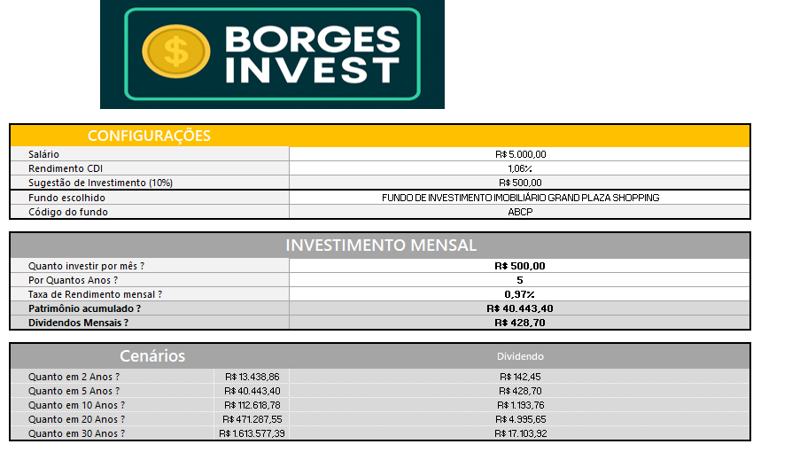
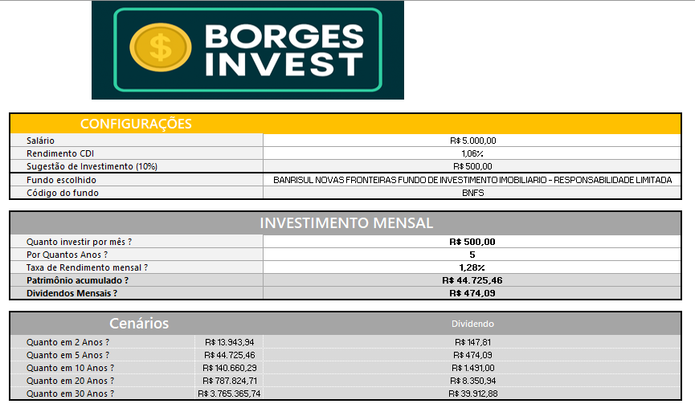
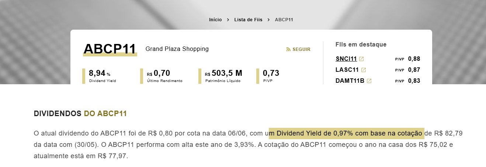
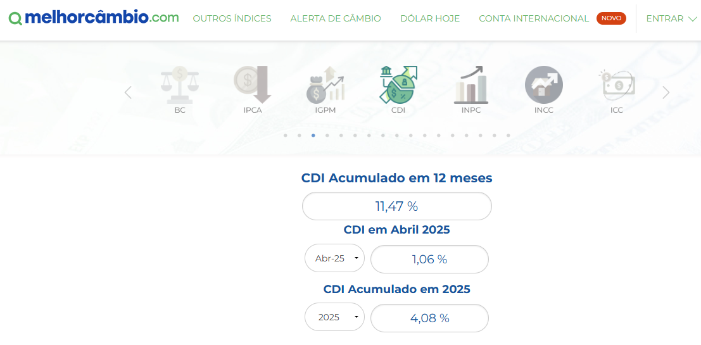

# ViniciusBorges_BootcampDIO
Planilha inteligente em Excel com simulação de aportes mensais, dividendos e comparação de fundos imobiliários via dados da B3
**Simulador de Investimentos em Fundos Imobiliários (FIIs)**  
Planilha desenvolvida para auxiliar usuários a simular investimentos em FIIs, permitindo o cálculo de rendimento mensal, dividendos e patrimônio acumulado.

## 📈 Descrição

Este projeto consiste em uma planilha elaborada no Excel para simular investimentos em Fundos Imobiliários (FIIs). A ferramenta possibilita ao usuário estimar o valor acumulado ao longo do tempo, os rendimentos mensais e os dividendos, a partir de parâmetros definidos manualmente.

## ⚙️ Funcionalidades

- Cálculo automático do valor total investido com base em aportes mensais
- Seleção de fundos imobiliários a partir de uma lista extraída da B3
- Simulação dos rendimentos mensais com base na taxa de dividendos do fundo escolhido
- Estimativa mês a mês do patrimônio acumulado
- Comparação entre diferentes cenários de investimento

## 🧠 Fórmulas e Recursos Utilizados

- **Fórmulas:** `SE`, `SOMA`, `MULT`, `ÍNDICE`, `PROCV`, `VF`, `TAXA`
- **Recursos adicionais:**
  - Validação de dados com listas suspensas
  - Gráficos dinâmicos
  - Organização por abas: *Investimento*, *Resultados* e *Dashboard*

## 📝 Como Utilizar

1. Abra o arquivo `Simulador_FIIs.xlsx`
2. Preencha os seguintes campos:
   - Salário atual
   - Rendimento mensal do CDI
   - Percentual do salário destinado a investimentos
   - Fundo imobiliário de interesse (selecionado por lista suspensa)
3. Visualize os resultados automaticamente gerados na aba **Resultados**

## 📸 Capturas de Tela

#### 🧾 Simulações de Fundos

  

#### 📊 Visualização das Taxas

  
  

## 🔗 Fontes de Dados

- [Taxa CDI](https://www.melhorcambio.com/cdi)  
- [Rendimentos dos FIIs](https://fiis.com.br/lista-de-fundos-imobiliarios/)  
- [Fundos listados na B3](https://www.b3.com.br/pt_br/produtos-e-servicos/negociacao/renda-variavel/fundos-de-investimentos/fii/fiis-listados/)

## 👨‍💻 Autor

Vinicius Borges  
[LinkedIn: viniciusagborges](https://www.linkedin.com/in/viniciusagborges/)
